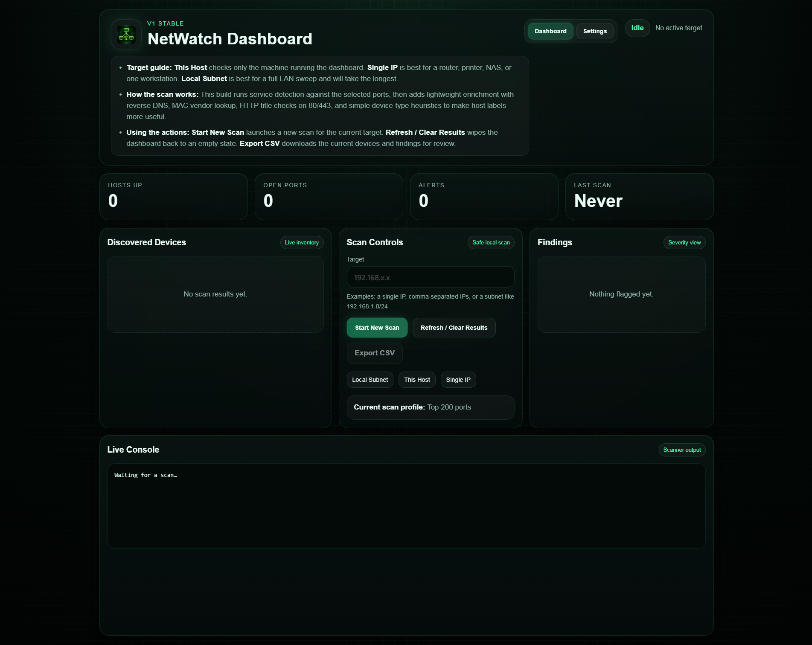
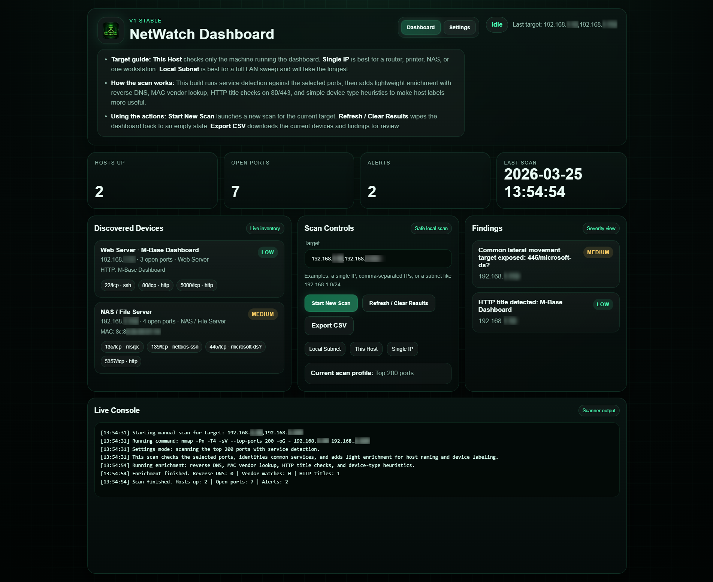
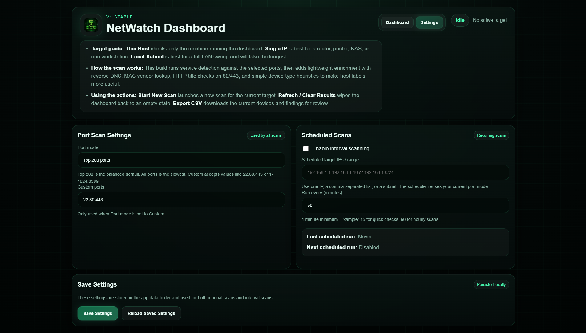

# NetWatch-Dashboard

NetWatch-Dashboard is a lightweight local network visibility and review tool built for self-hosting with Docker. It provides a clean web UI for discovering hosts, reviewing open ports and detected services, applying lightweight enrichment, exporting results to CSV, and running recurring scans on your internal network.



## What it does

NetWatch-Dashboard is designed for internal network inventory and defensive review. It can:

- scan a single IP, comma-separated IP list, or subnet
- identify responding hosts
- detect open ports and common services
- enrich host labels with reverse DNS, MAC vendor lookup, HTTP title checks on ports 80/443, and simple device-type heuristics
- export current results to CSV
- save scan preferences locally
- run recurring scans against configured targets at a chosen interval

## Best fit

This project is best suited for:

- home labs
- small office networks
- maker spaces
- internal infrastructure review
- quick visibility into routers, printers, NAS devices, cameras, workstations, and servers

## Platform notes

NetWatch-Dashboard is intended primarily for **Linux hosts**, especially **Ubuntu Server**, because it uses Docker host networking for better LAN visibility.

On Docker Desktop for macOS or Windows, networking behavior may differ from Linux and scan visibility may be limited.

## Interface

### Dashboard

The main dashboard provides:

- summary cards for hosts up, open ports, alerts, and last scan time
- discovered device inventory
- scan controls
- findings panel
- live console output
- CSV export



### Settings

The Settings page allows you to configure:

- port scan mode
- custom comma-separated ports
- scheduled scan targets
- recurring scan interval
- persisted local settings



## Scan behavior

NetWatch-Dashboard supports three target styles:

- **This Host**  
  Scans only the machine running the dashboard.

- **Single IP**  
  Best for a router, printer, NAS, camera, or one workstation.

- **Local Subnet**  
  Best for a broader LAN sweep and will take the longest.

### Port modes

The scanner supports:

- **Top 200 ports**  
  Balanced default for useful visibility with reasonable runtime.

- **All ports**  
  Full port sweep. Slowest option.

- **Custom ports**  
  Comma-separated ports or ranges such as:
  - `22,80,443,3389`
  - `1-1024,8080,8443`

### Enrichment

The scanner adds lightweight enrichment to make host labels more useful:

- reverse DNS lookups
- MAC vendor lookup
- HTTP title grabbing on ports 80/443
- simple device-type heuristics

This helps reduce generic labels and makes it easier to identify likely routers, printers, NAS devices, cameras, Windows hosts, Linux systems, and IoT devices.

## Scheduled scans

The built-in scheduler can run recurring scans against configured targets at a set interval.

You can configure:

- whether recurring scans are enabled
- target IPs or ranges
- interval in minutes
- port mode used for scheduled runs

Settings are stored locally in the mounted data folder.

## Security and intended use

NetWatch-Dashboard is meant for **systems you own or are explicitly authorized to assess**.

Use it responsibly and keep it on internal networks unless you fully understand the exposure and operational risks.

This project is intended for:

- internal visibility
- inventory
- defensive review
- basic service identification

It is **not** a full authenticated vulnerability scanner and does not replace formal security assessment tooling.

## Quick start

### Docker Compose

Create a `docker-compose.yml` file:

```yaml
version: "3.8"

services:
  netwatch:
    image: ghcr.io/atomnft/netwatch-dashboard:latest
    container_name: netwatch-dashboard
    ports:
      - "5000:5000"
    restart: unless-stopped
    environment:
      - DEFAULT_SCAN_TARGET=192.168.1.0/24
      - DEFAULT_TOP_PORTS=200
      - APP_PORT=5000
      - SETTINGS_DIR=/app/data
    volumes:
      - ./data:/app/data